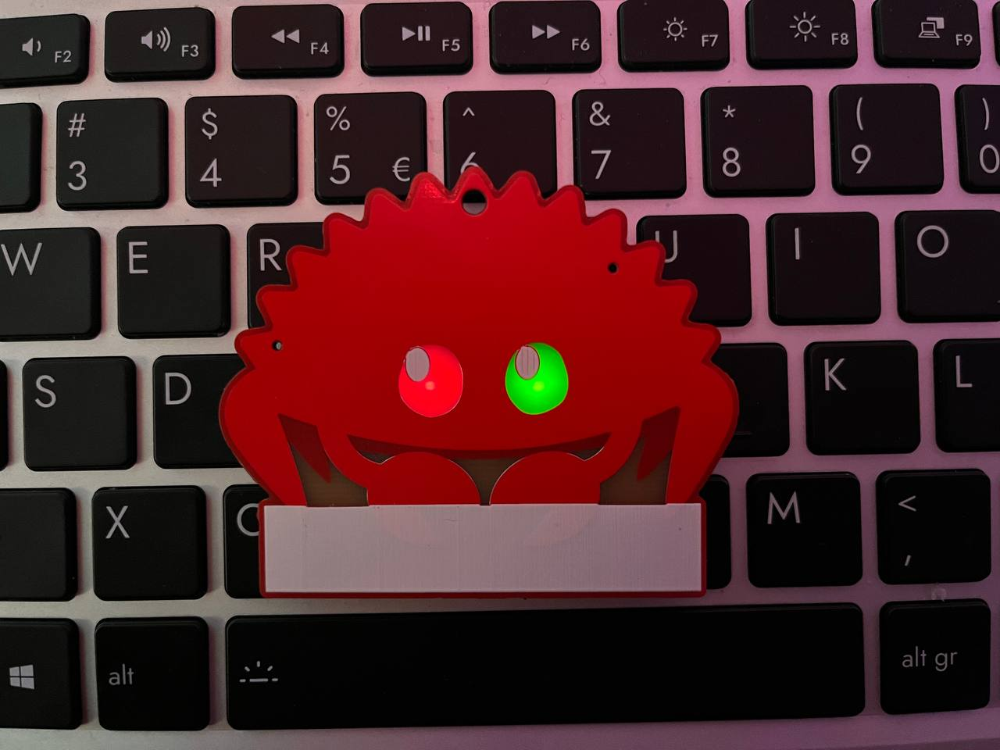
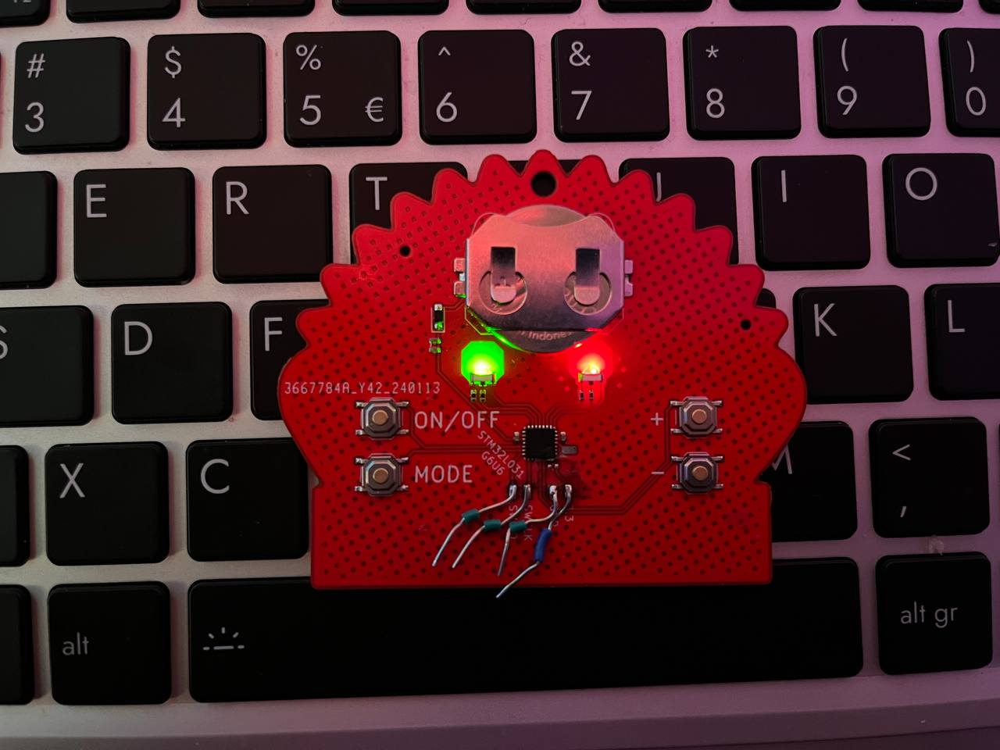

# Ferris STM32L0 badge

Small badge running on a coin cell using a STM32L031G6U with embassy.

## Known bugs

- BOOT0 is not connected
- Reverse polarity protection diode should be swapped with MOSFET
- Pnput caps could be larger to minimize peak current during PWM